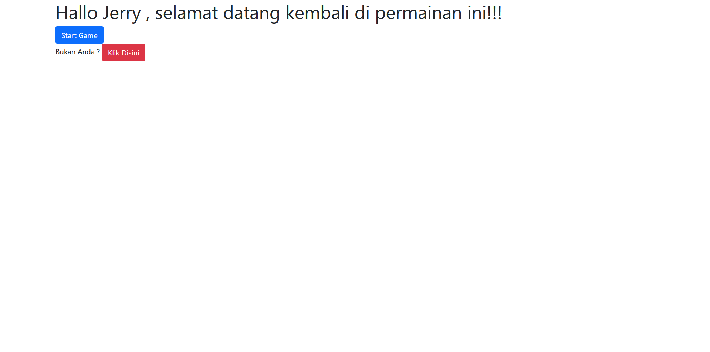
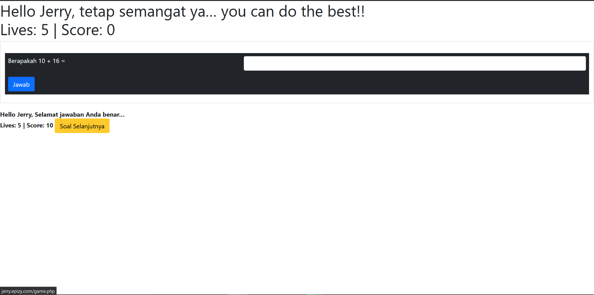
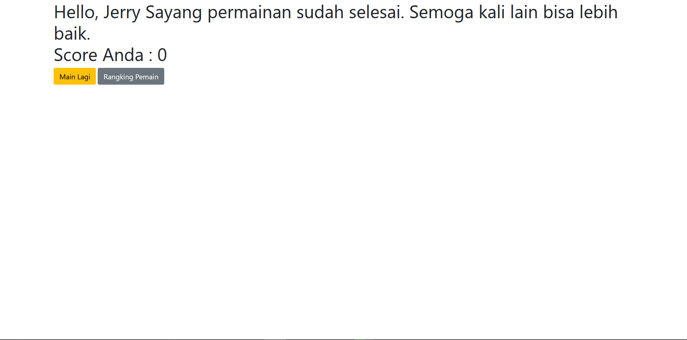
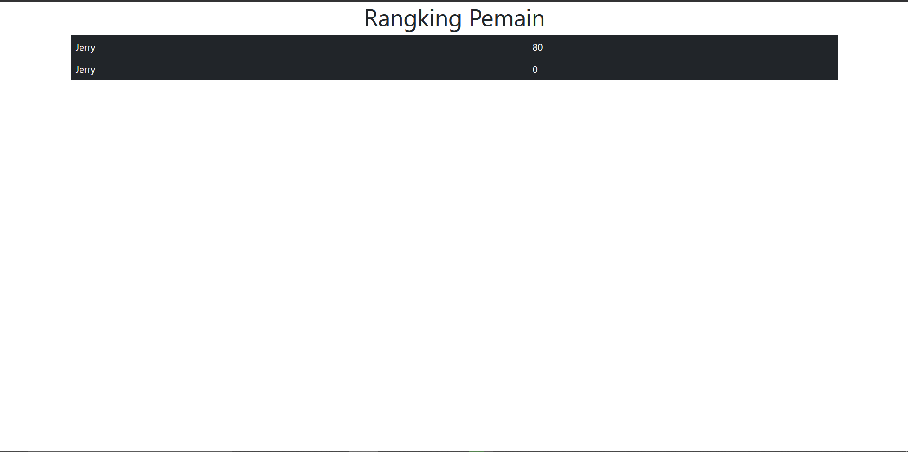

# Website UTS

> Game Penjumlahan Sederhana. Game akan dimulai dengan skor awal pemain 0 dan nyawa pemain 5. Jika pemain berhasil menjawab dengan benar maka skor pemain akan bertambah 10. Jika pemain salah menjawab maka nyawa akan berkurang 1 dan skor akan berkurang 2. Game berakhir jika nyawa pemain 0.

# Tampilan Website

## Halaman Awal
- Jika Sudah Login

- Jika Belum Login

## Halaman Game
 - Permainan Berlangsung

 - Permainan Berakhir

## Halaman Rangking

# Link Website : jerry.epizy.com